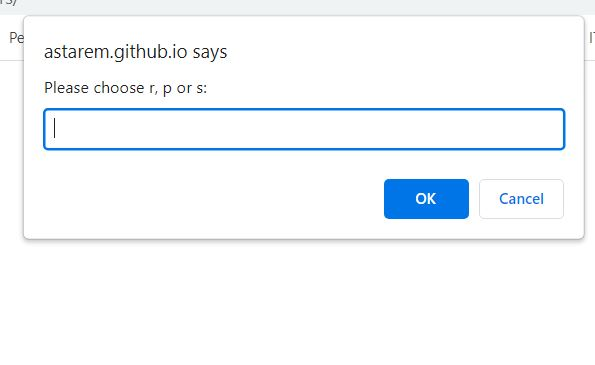

# Rock, paper, scissors game

## Description

User plays against computer. User is prompted to enter either r, p or s - for rock, paper, scissors. Computer does a random choice. 
It gives the result of the single game to the user in alert box, and at the end of all games (6 in this instance), it logs statistics in the console - how many wins, losses and ties total user had.

- I have build this game to practice approaching the problem, making a plan and writing the code using JavaScript 

## Installation

There is no installation needed. 

## Usage

[View](https://astarem.github.io/rock-paper-scissors/) this game. 

At this stage, all action takes place in alert box and outcomes are in console.
## Stage of the project
- In progress

This is the starting stage of the game - to make it work with Javascript (game logic).

Come back later and make it usable by manipulating DOM, add more HTML and style with CSS or Bootstrap.

